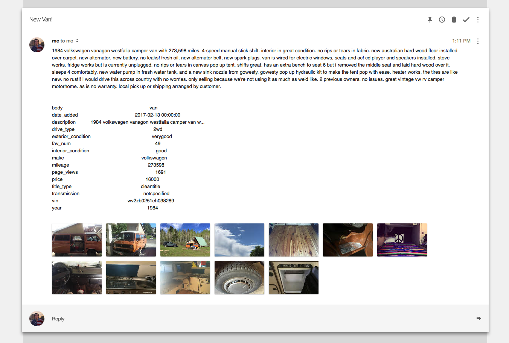

# VanFinder

A machine learning tool that scans KSL classifieds to find good deals on vans and other vehicles. It builds a database of listings, analyzes historical data (views, likes), and emails you when it finds a great deal.

## How It Works

1. **`get_data.py`** - Scrapes KSL classifieds and builds a database of van listings
2. **`check_vans.py`** - Updates the database, runs the ML model to score listings, and sends email alerts for the best deals
3. **`van_life.ipynb`** - Notebook explaining the data pipeline and model

## Screenshots

## Tech Stack

- Python
- scikit-learn (decision tree classifier)
- Web scraping
- Email notifications
